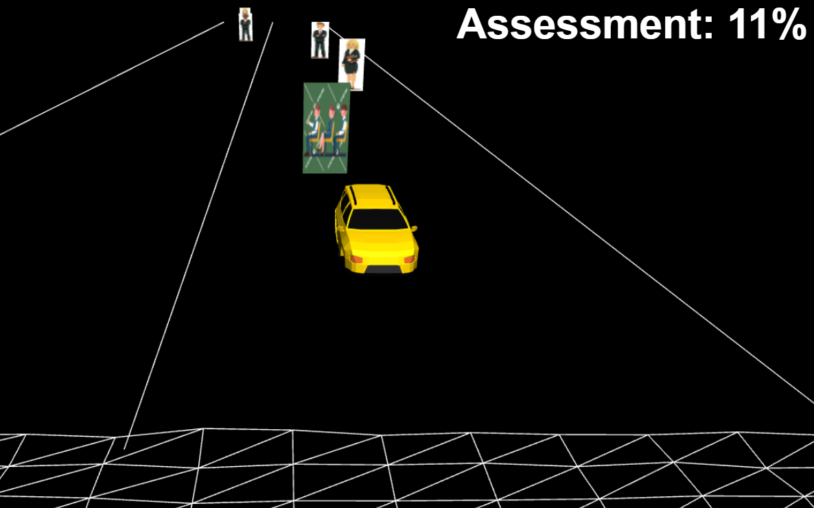

# Hyper Island Assessment Race

Hyper Island Assessment Race is an exciting game where players assist students in driving their car and navigating through a series of assessors without colliding with them. The objective is to reach a 100% score and successfully pass the assessments.

## Table of Contents
- [Features](#features)
- [Screenshots](#screenshots)
- [Installation](#installation)
- [Usage](#usage)
- [Contributing](#contributing)
- [License](#license)

## Features

- Engaging race gameplay
- Physics and controls
- Various assessors characters
- Score tracking and progress indicator
- Multiple levels with increasing difficulty

## Screenshots

> Game environment

## Installation

1. Clone the repository
2. Navigate to the project directory: 
3. Install the required dependencies: `npm install`

## Usage

1. Launch the game: `npm start`
2. Use the arrow keys or WASD for car movement and steering.
3. Avoid colliding with assessors to maintain a high score.
4. Complete the race by reaching a 100% score to pass the assessments.

## Contributing

Contributions are welcome! Here's how you can contribute to the project:

1. Fork the repository.
2. Create a new branch: `git checkout -b feature/your-feature`
3. Make your changes and commit them: `git commit -m 'Add some feature'`
4. Push to the branch: `git push origin feature/your-feature`
5. Open a pull request.

Please ensure that your code follows the project's coding conventions and includes appropriate documentation.

## License

This project is licensed under the [ISC License](LICENSE).

---
